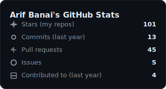

# Hi, I'm Arif 👋

> A backend/software engineer focused on Java, Python, distributed systems, developer tooling, and open source.

I enjoy building reliable systems, improving developer workflows, and maintaining practical software that people actually use.

*Can be updated via GitHub Actions. To regenerate locally, see [scripts/README.md](scripts/README.md).*

## Currently Working On

- Maintaining and improving [MusicBot](https://github.com/arif-banai/MusicBot)
- Building automation and tooling projects
- Exploring product ideas in analytics, finance, and developer infrastructure

## Featured Projects

- [MusicBot](https://github.com/arif-banai/MusicBot) — My actively maintained fork of JMusicBot with upgrades, fixes, CI/CD improvements, and better deployment support

## Areas I Work In

- Backend engineering
- Distributed systems
- APIs and integrations
- DevOps / CI/CD
- Open source maintenance :D

## Connect With Me

- https://www.linkedin.com/in/arif-banai/
